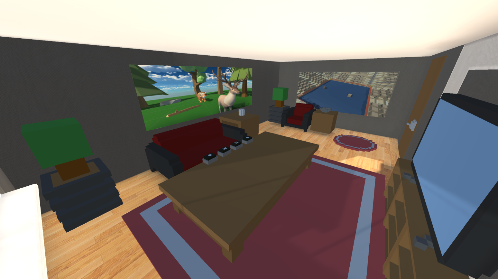

# VR-XR-GameRoom

## Description

GameRoom is a VR simulation created using Unity. Players are placed in front of a table in a virtual game room where they can interact with buttons to manage a table battlefield. It's a sandbox experience that gives you the freedom to explore and interact with the virtual environment however you like.

## Key Features

* **VR Environment**: Step into a fully interactive virtual game room
* **Battle System**: Control dynamic battles where shapes compete for table dominance
* **Physics Interactions**: Pick up, throw, and manipulate shapes with realistic physics
* **Team Tactics**: Watch as shapes coordinate with allies, combining their strength to overcome opponents
* **Dynamic Color Fusion**: Shapes merge and combine colors during battle

## Game Controls

Play sitting or standing as you use VR controllers to naturally interact with the virtual space. Grab and throw shapes with your hands, press buttons to control the action, and shape the battlefield exactly how you want it.

### Button Controls

* **Cube Spawner Button**: Spawn cubes on the left side of the table
* **Sphere Spawner Button**: Spawn spheres on the right side of the table
* **Play/Pause Button**: Controls the battle sequence
* **Clear Button**: Removes all shapes from the table

## About the Project

This project demonstrates my VR development capabilities using Unity. It started as an experimental project with an old VR headset, aimed at learning VR development fundamentals, including VR interactions and physics-based mechanics. Over time, it evolved into a more interactive sandbox experience, incorporating dynamic object interactions and a battle system. The project showcases how VR can create immersive environments.

## Preview

|  |  |  |
|:---:|:---:|:---:|

## Installation & Requirements

* **Hardware Required**: Compatible VR headset
* **Download**: Get the game ZIP file here: [Google Drive Download](https://drive.google.com/file/d/1iS6L9QTpPZwT1Ae1G_lnBgOKCBoaYw5H/view?usp=sharing)
* **Installation**: Extract the ZIP file and run the executable